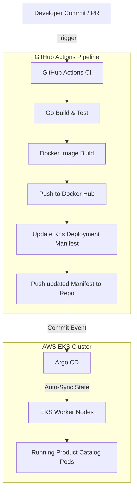

# Ultimate DevSecOps & GitOps Project Demo

A production-grade, end-to-end GitOps and DevSecOps pipeline automating the lifecycle of a Go-based microservice (**Product Catalog Service**) deployed on a managed **AWS EKS (Elastic Kubernetes Service)** cluster. 

This repository showcases industry-standard modern DevOps practices, integrating automated CI/CD pipelines, containerization, Infrastructure-as-Code principles, and GitOps-based continuous delivery.

---

## 📽️ Project Demo Video
Watch the end-to-end walkthrough showing the automated CI pipeline triggering, manifest updating, and GitOps synchronization to AWS EKS:

👉 **[Download / Watch the Demo Video](./assets/project_demo.mov)** *(Saved in repository assets)*

---

## 🏗️ Architecture & Workflow

1. **Continuous Integration**: The developer pushes changes or opens a Pull Request to the `main` branch. A multi-job **GitHub Actions** workflow runs to build the Go app, package it into a Docker container, and push it to Docker Hub with a unique build ID.
2. **Automated Manifest Updates**: Upon a successful build, the pipeline dynamically patches the Kubernetes deployment manifest (`kubernetes/productcatalog/deploy.yaml`) with the new Docker image tag and commits it back to the repository.
3. **Continuous Delivery (GitOps)**: **Argo CD** (deployed on the Kubernetes cluster) monitors the repository for manifest changes and automatically synchronizes the new deployment state to the **AWS EKS** cluster.

---

## 🛠️ Technology Stack

* **Programming Language**: Go (Golang)
* **Infrastructure**: AWS (VPC, EC2, EKS Cluster with managed node groups)
* **Containerization**: Docker, Docker Hub
* **CI/CD Engine**: GitHub Actions (with customized write permissions for token-based push)
* **GitOps Continuous Delivery**: Argo CD
* **Configuration Management**: Kubernetes Manifests (YAML)

---

## 🚀 CI/CD Pipeline Implementation (`ci.yaml`)

The GitHub Actions workflow includes:
* **Security & Write Permissions**: The pipeline is granted `contents: write` permissions to allow the runner to push tag changes back to the repository.
* **Dynamic Tagging**: Image versions are tagged dynamically using the GitHub Run ID (`${{ github.run_id }}`).
* **Deployment Manifest Patching**: Uses `sed` to update the image reference programmatically before committing.

---

## ☸️ GitOps with Argo CD

Argo CD is set up inside the `argocd` namespace on the cluster:
* **Namespace separation**: Isolates controller and server pods.
* **High Availability**: LoadBalancer service type is used to expose the Argo CD API/UI server over the internet.
* **Auto-sync**: Configured to poll this repository and automatically deploy changes when new commits are pushed to the `main` branch.
